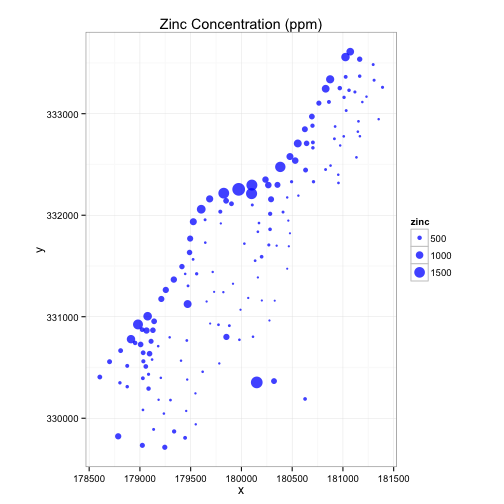
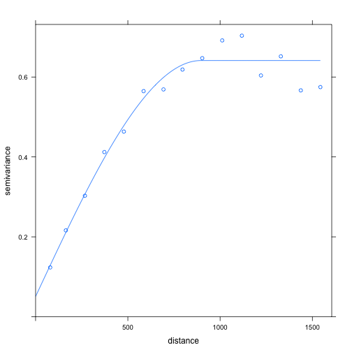
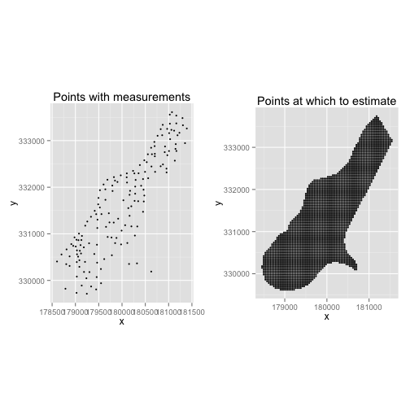
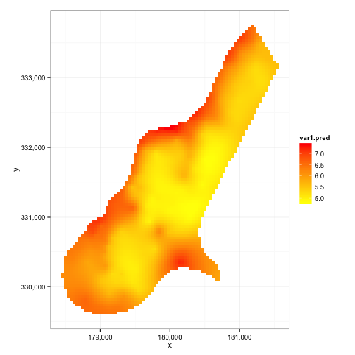

## Introduction

When I first started working with spatial data in R, it took me a while before I could get used to it. There was several obstacles, not the least of which being just to find which tutorials in which sequence would best help me grasp the larger picture of SP* classes. My own personal difficulties aside, I eventually acclimated myself to them, and joined the r-sig-geo group to follow up with any developments pertinent to my work. 

So, partly as a means of contributing to documentation that would help my own code be more readily understood by others, and partly due to finding that professionals on the r-sig-geo group were encountering some similar questions I had when I first started, I thought I would present an overview of some of the functionality available for working with spatial data in R.

This document, though, is intended to be an introduction to working with kriging in R. A familiarity with kriging is already assumed; there are already more comprehensive resources available for anyone interested, whether broad overviews or more mathematical expositions with all the gory matrix algebra details. In particular, [Allison Lassiter's blog](http://allisonlassiter.com/author/allison-lassitergmail-com/) was a helpful resource when I was just getting started.

## Packages Used

In working with spatial data, the sp library is essential, and what many other packages build off of. More specifically, the spatial classes (e.g., SpatialPoints, SpatialPointsDataFrame, etc) are defined in the sp package, while spatio-temporal classes are defined in the spacetime package. 

For working with spatial (and spatio-temporal) data, we use the gstat package, which includes functionality for kriging, among other many things. 


```r
library(sp)
library(gstat)
```

## Dataset

The data we are using is the meuse dataset, which comes with the sp package. 


```r
# packages for manipulation & visualization
suppressPackageStartupMessages({
  library(dplyr) # for "glimpse"
  library(ggplot2)
  library(scales) # for "comma"
  library(magrittr)
})

data(meuse)
glimpse(meuse)
```

```
## Observations: 155
## Variables: 14
## $ x       (dbl) 181072, 181025, 181165, 181298, 181307, 181390, 181165...
## $ y       (dbl) 333611, 333558, 333537, 333484, 333330, 333260, 333370...
## $ cadmium (dbl) 11.7, 8.6, 6.5, 2.6, 2.8, 3.0, 3.2, 2.8, 2.4, 1.6, 1.4...
## $ copper  (dbl) 85, 81, 68, 81, 48, 61, 31, 29, 37, 24, 25, 25, 93, 31...
## $ lead    (dbl) 299, 277, 199, 116, 117, 137, 132, 150, 133, 80, 86, 9...
## $ zinc    (dbl) 1022, 1141, 640, 257, 269, 281, 346, 406, 347, 183, 18...
## $ elev    (dbl) 7.909, 6.983, 7.800, 7.655, 7.480, 7.791, 8.217, 8.490...
## $ dist    (dbl) 0.00135803, 0.01222430, 0.10302900, 0.19009400, 0.2770...
## $ om      (dbl) 13.6, 14.0, 13.0, 8.0, 8.7, 7.8, 9.2, 9.5, 10.6, 6.3, ...
## $ ffreq   (fctr) 1, 1, 1, 1, 1, 1, 1, 1, 1, 1, 1, 1, 1, 1, 1, 1, 1, 1,...
## $ soil    (fctr) 1, 1, 1, 2, 2, 2, 2, 1, 1, 2, 2, 1, 1, 1, 1, 1, 1, 1,...
## $ lime    (fctr) 1, 1, 1, 0, 0, 0, 0, 0, 0, 0, 0, 0, 1, 0, 0, 1, 1, 1,...
## $ landuse (fctr) Ah, Ah, Ah, Ga, Ah, Ga, Ah, Ab, Ab, W, Fh, Ag, W, Ah,...
## $ dist.m  (dbl) 50, 30, 150, 270, 380, 470, 240, 120, 240, 420, 400, 3...
```

The meuse dataset contains concentration measurements for a number of chemical elements, at the Meuse river in the Netherlands. More information can be found by checking the help page via "?meuse"

Of particular interest is that each of the values/measurements, are associated with geographic coordinates, the x- and y- columns. A priori, given just the dataframe and no additional information, it might not be clear that those two columns indicate locations (I, at least, had never heard of RDH coordinates before). And that's what the motivation for SPDF's was, to provide a structure which allows for coordinates to very clearly be associated with data points corresponding to them. 

Visually, we can inspect how zinc, for example, varies over the domain of interest, where we map concentration to point size:


```r
meuse %>% as.data.frame %>% 
  ggplot(aes(x, y)) + geom_point(aes(size=zinc), color="blue", alpha=3/4) + 
  ggtitle("Zinc Concentration (ppm)") + coord_equal() + theme_bw()
```

 

Clearly, the representiveness of the points sampled is still wanting, so ideally we would be able to estimate the zinc concentrations at other locations for which we don't have measurements. That's where kriging comes in.

## Implementation

Broadly speaking, there are a few steps involved in kriging a dataset. Assuming that the data is stored in a dataframe, then one must: 

1. Convert the dataframe to a spatial points dataframe (SPDF)

2. Fit a variogram model to the data

3. Krige the data according to the variogram. 


### 1) Converting to an SPDF

At the moment, the meuse data is just in a dataframe: 


```r
class(meuse)
```

```
## [1] "data.frame"
```

```r
str(meuse)
```

```
## 'data.frame':	155 obs. of  14 variables:
##  $ x      : num  181072 181025 181165 181298 181307 ...
##  $ y      : num  333611 333558 333537 333484 333330 ...
##  $ cadmium: num  11.7 8.6 6.5 2.6 2.8 3 3.2 2.8 2.4 1.6 ...
##  $ copper : num  85 81 68 81 48 61 31 29 37 24 ...
##  $ lead   : num  299 277 199 116 117 137 132 150 133 80 ...
##  $ zinc   : num  1022 1141 640 257 269 ...
##  $ elev   : num  7.91 6.98 7.8 7.66 7.48 ...
##  $ dist   : num  0.00136 0.01222 0.10303 0.19009 0.27709 ...
##  $ om     : num  13.6 14 13 8 8.7 7.8 9.2 9.5 10.6 6.3 ...
##  $ ffreq  : Factor w/ 3 levels "1","2","3": 1 1 1 1 1 1 1 1 1 1 ...
##  $ soil   : Factor w/ 3 levels "1","2","3": 1 1 1 2 2 2 2 1 1 2 ...
##  $ lime   : Factor w/ 2 levels "0","1": 2 2 2 1 1 1 1 1 1 1 ...
##  $ landuse: Factor w/ 15 levels "Aa","Ab","Ag",..: 4 4 4 11 4 11 4 2 2 15 ...
##  $ dist.m : num  50 30 150 270 380 470 240 120 240 420 ...
```

To convert it to a spatial dataframe, we must first specify which of the columns contain the coordinates of the data. This is done by using R's formula notation as follows: 


```r
coordinates(meuse) <- ~ x + y
class(meuse)
```

```
## [1] "SpatialPointsDataFrame"
## attr(,"package")
## [1] "sp"
```

```r
str(meuse)
```

```
## Formal class 'SpatialPointsDataFrame' [package "sp"] with 5 slots
##   ..@ data       :'data.frame':	155 obs. of  12 variables:
##   .. ..$ cadmium: num [1:155] 11.7 8.6 6.5 2.6 2.8 3 3.2 2.8 2.4 1.6 ...
##   .. ..$ copper : num [1:155] 85 81 68 81 48 61 31 29 37 24 ...
##   .. ..$ lead   : num [1:155] 299 277 199 116 117 137 132 150 133 80 ...
##   .. ..$ zinc   : num [1:155] 1022 1141 640 257 269 ...
##   .. ..$ elev   : num [1:155] 7.91 6.98 7.8 7.66 7.48 ...
##   .. ..$ dist   : num [1:155] 0.00136 0.01222 0.10303 0.19009 0.27709 ...
##   .. ..$ om     : num [1:155] 13.6 14 13 8 8.7 7.8 9.2 9.5 10.6 6.3 ...
##   .. ..$ ffreq  : Factor w/ 3 levels "1","2","3": 1 1 1 1 1 1 1 1 1 1 ...
##   .. ..$ soil   : Factor w/ 3 levels "1","2","3": 1 1 1 2 2 2 2 1 1 2 ...
##   .. ..$ lime   : Factor w/ 2 levels "0","1": 2 2 2 1 1 1 1 1 1 1 ...
##   .. ..$ landuse: Factor w/ 15 levels "Aa","Ab","Ag",..: 4 4 4 11 4 11 4 2 2 15 ...
##   .. ..$ dist.m : num [1:155] 50 30 150 270 380 470 240 120 240 420 ...
##   ..@ coords.nrs : int [1:2] 1 2
##   ..@ coords     : num [1:155, 1:2] 181072 181025 181165 181298 181307 ...
##   .. ..- attr(*, "dimnames")=List of 2
##   .. .. ..$ : chr [1:155] "1" "2" "3" "4" ...
##   .. .. ..$ : chr [1:2] "x" "y"
##   ..@ bbox       : num [1:2, 1:2] 178605 329714 181390 333611
##   .. ..- attr(*, "dimnames")=List of 2
##   .. .. ..$ : chr [1:2] "x" "y"
##   .. .. ..$ : chr [1:2] "min" "max"
##   ..@ proj4string:Formal class 'CRS' [package "sp"] with 1 slot
##   .. .. ..@ projargs: chr NA
```

#### Comments

Here, we see that a couple of things happen when we specify the coordinates. First, the dataframe becomes an SPDF. The SPDF class is structured in a way that the data is now clearly distinguished from the coordinates; under the hood, it is represented as an S4 object, where its data/attributes are stored in different "slots". For SPDF objects in particular, there are five different slots: 

- data 
- coords.nrs
- coords
- bbox
- and proj4string. 

The "data" slot contains all the variables associated with different spatial locations. Those locations, though, are stored in the "coords" slot, which is a matrix of all spatial locations with corresponding values in the dataframe. "coords.nrs" contains the column numbers of the spatial coordinates in the dataframe, like if you coerce the SPDF to a dataframe first (see below). 

"bbox" is the bounding box, that is, four points (or, "corners") which denote the spatial extent of the data. "proj4string" is the slot which contains the projection information, that is, what projection are the coordinates in? Since we haven't specified that yet, it's currently set to NA. 

Each of these slots can be accessed either directly via the "@" operator, or via helper functions which simplify the syntax for accessing them, e.g., 


```r
# access various slots of the SPDF
bbox(meuse)
```

```
##      min    max
## x 178605 181390
## y 329714 333611
```

```r
coordinates(meuse) %>% glimpse
```

```
## Observations: 155
## Variables: 2
## $ x (dbl) 181072, 181025, 181165, 181298, 181307, 181390, 181165, 1810...
## $ y (dbl) 333611, 333558, 333537, 333484, 333330, 333260, 333370, 3333...
```

```r
proj4string(meuse)
```

```
## [1] NA
```

And of course, both ways of accessing the slots, yield the same results: 


```r
identical( bbox(meuse), meuse@bbox )
```

```
## [1] TRUE
```

```r
identical( coordinates(meuse), meuse@coords )
```

```
## [1] TRUE
```

I'm not sure what the helper function for the coords.nrs slot is; while that slot contains the column numbers, the "coordnames" function gives the names of the columns containing the spatial coordinates.

Sometimes, certain functions (like with ggplot2) require using a dataframe and not an SPDF. In such cases, one can manually coerce the data back to a dataframe, to retain the coordinate information, as opposed to just accessing the "data" slot: 


```r
meuse@data %>% glimpse
```

```
## Observations: 155
## Variables: 12
## $ cadmium (dbl) 11.7, 8.6, 6.5, 2.6, 2.8, 3.0, 3.2, 2.8, 2.4, 1.6, 1.4...
## $ copper  (dbl) 85, 81, 68, 81, 48, 61, 31, 29, 37, 24, 25, 25, 93, 31...
## $ lead    (dbl) 299, 277, 199, 116, 117, 137, 132, 150, 133, 80, 86, 9...
## $ zinc    (dbl) 1022, 1141, 640, 257, 269, 281, 346, 406, 347, 183, 18...
## $ elev    (dbl) 7.909, 6.983, 7.800, 7.655, 7.480, 7.791, 8.217, 8.490...
## $ dist    (dbl) 0.00135803, 0.01222430, 0.10302900, 0.19009400, 0.2770...
## $ om      (dbl) 13.6, 14.0, 13.0, 8.0, 8.7, 7.8, 9.2, 9.5, 10.6, 6.3, ...
## $ ffreq   (fctr) 1, 1, 1, 1, 1, 1, 1, 1, 1, 1, 1, 1, 1, 1, 1, 1, 1, 1,...
## $ soil    (fctr) 1, 1, 1, 2, 2, 2, 2, 1, 1, 2, 2, 1, 1, 1, 1, 1, 1, 1,...
## $ lime    (fctr) 1, 1, 1, 0, 0, 0, 0, 0, 0, 0, 0, 0, 1, 0, 0, 1, 1, 1,...
## $ landuse (fctr) Ah, Ah, Ah, Ga, Ah, Ga, Ah, Ab, Ab, W, Fh, Ag, W, Ah,...
## $ dist.m  (dbl) 50, 30, 150, 270, 380, 470, 240, 120, 240, 420, 400, 3...
```

```r
meuse %>% as.data.frame %>% glimpse
```

```
## Observations: 155
## Variables: 14
## $ x       (dbl) 181072, 181025, 181165, 181298, 181307, 181390, 181165...
## $ y       (dbl) 333611, 333558, 333537, 333484, 333330, 333260, 333370...
## $ cadmium (dbl) 11.7, 8.6, 6.5, 2.6, 2.8, 3.0, 3.2, 2.8, 2.4, 1.6, 1.4...
## $ copper  (dbl) 85, 81, 68, 81, 48, 61, 31, 29, 37, 24, 25, 25, 93, 31...
## $ lead    (dbl) 299, 277, 199, 116, 117, 137, 132, 150, 133, 80, 86, 9...
## $ zinc    (dbl) 1022, 1141, 640, 257, 269, 281, 346, 406, 347, 183, 18...
## $ elev    (dbl) 7.909, 6.983, 7.800, 7.655, 7.480, 7.791, 8.217, 8.490...
## $ dist    (dbl) 0.00135803, 0.01222430, 0.10302900, 0.19009400, 0.2770...
## $ om      (dbl) 13.6, 14.0, 13.0, 8.0, 8.7, 7.8, 9.2, 9.5, 10.6, 6.3, ...
## $ ffreq   (fctr) 1, 1, 1, 1, 1, 1, 1, 1, 1, 1, 1, 1, 1, 1, 1, 1, 1, 1,...
## $ soil    (fctr) 1, 1, 1, 2, 2, 2, 2, 1, 1, 2, 2, 1, 1, 1, 1, 1, 1, 1,...
## $ lime    (fctr) 1, 1, 1, 0, 0, 0, 0, 0, 0, 0, 0, 0, 1, 0, 0, 1, 1, 1,...
## $ landuse (fctr) Ah, Ah, Ah, Ga, Ah, Ga, Ah, Ab, Ab, W, Fh, Ag, W, Ah,...
## $ dist.m  (dbl) 50, 30, 150, 270, 380, 470, 240, 120, 240, 420, 400, 3...
```

Once coerced, the data can just be piped into the next function you want to use.

### 2) Fitting a variogram

To perform kriging, you must first have a variogram model, from which the data can be interpolated. There are a couple steps involved:

1. Calculate the sample variogram. This is done with the "variogram" function.

2. Fit a model to the sample variogram

For example, a variogram could be fit as simply as the following code:


```r
lzn.vgm <- variogram(log(zinc)~1, meuse) # calculates sample variogram values 
lzn.fit <- fit.variogram(lzn.vgm, model=vgm(1, "Sph", 900, 1)) # fit model
```

#### Commentary

Since these functions don't (at least to me), have immediately obvious orderings for the parameters used, it's probably worthwhile to elaborate on what the objects being passed as parameters aactually are. 

The "variogram" function can take two arguments: the first being denoting how one or more variables interact spatially, and the second is an SPDF where those variables reside. 

For the fit.variogram function, a sample variogram is the first argument. The second is the model, with parameters, to be fit to the sample variogram. For a list of all possible variograms that can be used, call "vgm()", and to see graphical properties/characteristics of these models, call "show.vgms()".

With the sample and fit variogram, one can plot them together to see how well the fit was:


```r
plot(lzn.vgm, lzn.fit) # plot the sample values, along with the fit model
```

 


### 3) Performing Kriging

#### Setup

By definition, interpolation is estimating values at points we don't have measurements for, based on the points for which we do have measurements. Then, we need two spatial domains: one having values associated with the points, and one for which we want estimates. In this example, the spatial domains we use are those of "meuse" and "meuse.grid":


```r
# load spatial domain to interpolate over
data("meuse.grid")

# to compare, recall the bubble plot above; those points were what there were values for. this is much more sparse
plot1 <- meuse %>% as.data.frame %>%
  ggplot(aes(x, y)) + geom_point(size=1) + coord_equal() + 
  ggtitle("Points with measurements")

# this is clearly gridded over the region of interest
plot2 <- meuse.grid %>% as.data.frame %>%
  ggplot(aes(x, y)) + geom_point(size=1) + coord_equal() + 
  ggtitle("Points at which to estimate")

library(gridExtra)
grid.arrange(plot1, plot2, ncol = 2)
```

 


### Computation

Once we have the prepared all of the above, we are now ready to krige. This can be done with the gstat::krige function, which usually takes four arguments:

1. The model formula

2. An SPDF of the spatial domain that has measurements

3. An SPDF of the spatial domain to krige over

4. A variogram model fitted to the data.

Note that the second and third arguments have to be SPDF's, and cannot just be dataframes.

Now, the kriging step can be performed in a single function call:


```r
coordinates(meuse.grid) <- ~ x + y # step 3 above
lzn.kriged <- krige(log(zinc) ~ 1, meuse, meuse.grid, model=lzn.fit)
```

```
## [using ordinary kriging]
```

These results could be visualized as a heatmap: 


```r
lzn.kriged %>% as.data.frame %>%
  ggplot(aes(x=x, y=y)) + geom_tile(aes(fill=var1.pred)) + coord_equal() +
  scale_fill_gradient(low = "yellow", high="red") +
  scale_x_continuous(labels=comma) + scale_y_continuous(labels=comma) +
  theme_bw()
```

 

From this, we see that the zinc concentrations tend to be higher closer to the coast ("var1.pred" is the predicted measurement for the variable being interpolated). And what's more, lzn.kriged also contains the variance of each prediction as well.

## Further Resources

This document was intended to be more of a light introduction on how kriging is done, for someone looking to start using R for spatial data analysis. For a little more detail, see the document where I work through the meuse tutorial, and elaborate on parts that weren't immediately clear to me. That covers more on how some of these different objects are structured.

Now, depending on how much data you are working with, you might not be able to manually specify the parameters for each variogram you fit a set of data to. Once you become more comfortable with how variogram modelling and kriging works, you might want to take a look at the [automap package](http://www.numbertheory.nl/2013/02/17/automatic-spatial-interpolation-with-r-the-automap-package/) by Paul Hiemstra; it's been extremely helpful for the modeling work I do.

## Session


```r
devtools::session_info()
```

```
## Session info --------------------------------------------------------------
```

```
##  setting  value                       
##  version  R version 3.1.2 (2014-10-31)
##  system   x86_64, darwin13.4.0        
##  ui       RStudio (0.99.697)          
##  language (EN)                        
##  collate  en_US.UTF-8                 
##  tz       America/New_York            
##  date     2015-10-14
```

```
## Packages ------------------------------------------------------------------
```

```
##  package    * version    date       source                        
##  assertthat   0.1        2013-12-06 CRAN (R 3.1.0)                
##  colorspace   1.2-6      2015-03-11 CRAN (R 3.1.3)                
##  DBI          0.3.1.9008 2015-05-25 Github (rstats-db/DBI@0a4f0af)
##  devtools     1.9.1      2015-09-11 CRAN (R 3.1.2)                
##  digest       0.6.8      2014-12-31 CRAN (R 3.1.2)                
##  dplyr      * 0.4.3      2015-09-01 CRAN (R 3.1.2)                
##  evaluate     0.8        2015-09-18 CRAN (R 3.1.3)                
##  FNN          1.1        2013-07-31 CRAN (R 3.1.1)                
##  formatR      1.2.1      2015-09-18 CRAN (R 3.1.3)                
##  ggplot2    * 1.0.1      2015-03-17 CRAN (R 3.1.2)                
##  gridExtra  * 2.0.0      2015-07-14 CRAN (R 3.1.3)                
##  gstat      * 1.0-26     2015-08-26 CRAN (R 3.1.3)                
##  gtable       0.1.2      2012-12-05 CRAN (R 3.1.0)                
##  highr        0.5.1      2015-09-18 CRAN (R 3.1.3)                
##  htmltools    0.2.6      2014-09-08 CRAN (R 3.1.1)                
##  intervals    0.15.0     2014-09-19 CRAN (R 3.1.1)                
##  knitr      * 1.11       2015-08-14 CRAN (R 3.1.2)                
##  labeling     0.3        2014-08-23 CRAN (R 3.1.1)                
##  lattice      0.20-33    2015-07-14 CRAN (R 3.1.3)                
##  magrittr   * 1.5        2014-11-22 CRAN (R 3.1.2)                
##  MASS         7.3-41     2015-06-18 CRAN (R 3.1.3)                
##  memoise      0.2.1      2014-04-22 CRAN (R 3.1.0)                
##  munsell      0.4.2      2013-07-11 CRAN (R 3.1.0)                
##  plyr         1.8.3      2015-06-12 CRAN (R 3.1.3)                
##  proto        0.3-10     2012-12-22 CRAN (R 3.1.0)                
##  R6           2.1.1      2015-08-19 CRAN (R 3.1.3)                
##  Rcpp         0.12.1     2015-09-10 CRAN (R 3.1.3)                
##  reshape2     1.4.1      2014-12-06 CRAN (R 3.1.2)                
##  rmarkdown    0.8        2015-08-30 CRAN (R 3.1.2)                
##  scales     * 0.3.0      2015-08-25 CRAN (R 3.1.3)                
##  sp         * 1.1-1      2015-06-05 CRAN (R 3.1.3)                
##  spacetime    1.1-4      2015-04-24 CRAN (R 3.1.3)                
##  stringi      0.5-5      2015-06-29 CRAN (R 3.1.3)                
##  stringr      1.0.0      2015-04-30 CRAN (R 3.1.3)                
##  xts          0.9-7      2014-01-02 CRAN (R 3.1.0)                
##  yaml         2.1.13     2014-06-12 CRAN (R 3.1.0)                
##  zoo          1.7-12     2015-03-16 CRAN (R 3.1.3)
```


