The following is taken from a vignette in the gstat package. gstat contains 
"geostatistical" functions, which can perform spatial (or, spatio-temporal) 
interpolations. This is particularly useful when you have data for certain 
points in a large area, and want some idea of how the values for that data 
being measured, might vary elsewhere.

In having tried to understand how work with spatial and spatio-temporal 
(hereafter denoted "S/T") data in R, I've realized there's a better way. First, 
for those looking to start, since gstat has functions that deal with spatial and 
S/T data, understanding how those structures work would probably be very useful 
when you start dealing with this package. 

At least for me, there were certain aspects of this tutorial which weren't 
obvious when I read through it, and in the end, took a while before I felt 
like I had a comfortable sense of what was happening. So, I thought I could 
elaborate on parts which weren't immediately obvious to me. Along the way, to 
help myself, I thought to code it how I've become used to. Hence, the plots 
are all re-done in ggplot2 (with the originals alongside for comparison), and 
the pipe operator `%>%` can really help clarify steps in involved operations. 


```r
library(sp)
library(tidyr)
library(ggplot2)
library(magrittr, warn.conflicts = FALSE)
```

Basically, the Meuse dataset contains measurements for concentrations of 
different elements, over an area in the Netherlands. Run ?meuse for more info.


```r
data(meuse)
class(meuse)
```

```
## [1] "data.frame"
```

```r
str(meuse)
```

```
## 'data.frame':	155 obs. of  14 variables:
##  $ x      : num  181072 181025 181165 181298 181307 ...
##  $ y      : num  333611 333558 333537 333484 333330 ...
##  $ cadmium: num  11.7 8.6 6.5 2.6 2.8 3 3.2 2.8 2.4 1.6 ...
##  $ copper : num  85 81 68 81 48 61 31 29 37 24 ...
##  $ lead   : num  299 277 199 116 117 137 132 150 133 80 ...
##  $ zinc   : num  1022 1141 640 257 269 ...
##  $ elev   : num  7.91 6.98 7.8 7.66 7.48 ...
##  $ dist   : num  0.00136 0.01222 0.10303 0.19009 0.27709 ...
##  $ om     : num  13.6 14 13 8 8.7 7.8 9.2 9.5 10.6 6.3 ...
##  $ ffreq  : Factor w/ 3 levels "1","2","3": 1 1 1 1 1 1 1 1 1 1 ...
##  $ soil   : Factor w/ 3 levels "1","2","3": 1 1 1 2 2 2 2 1 1 2 ...
##  $ lime   : Factor w/ 2 levels "0","1": 2 2 2 1 1 1 1 1 1 1 ...
##  $ landuse: Factor w/ 15 levels "Aa","Ab","Ag",..: 4 4 4 11 4 11 4 2 2 15 ...
##  $ dist.m : num  50 30 150 270 380 470 240 120 240 420 ...
```

If you'll notice, there are two columns `x` and `y` in the dataset. These are 
the coordinates of the location which that row of the dataframe corresponds to 
(if the numbers seem large, don't worry, it's just Rijksdriehoek (RDH) 
coordinates, used in the Netherlands.)

Now, while it's easy to include spatial information, like coordinates, just 
in columns of a dataframe, if someone else looks at the data, it might not be 
obvious what all the variables in the columns represent. So, one way to deal 
with this is to more concretely identify the observations with the corresponding 
location. Here, the result is going to be a `SpatialPointsDataFrame`. This 
assignment can be done like normally, except that the formula notation is used:


```r
coordinates(meuse) <- ~ x + y
class(meuse)
```

```
## [1] "SpatialPointsDataFrame"
## attr(,"package")
## [1] "sp"
```

Once that assignment is performed, then the class of the object changes 
accordingly.

Behind the scenes, this new Spatial*DataFrame is actually an S4 object (i.e., 
that's the system of OO-programming used for it in R) :


```r
str(meuse)
```

```
## Formal class 'SpatialPointsDataFrame' [package "sp"] with 5 slots
##   ..@ data       :'data.frame':	155 obs. of  12 variables:
##   .. ..$ cadmium: num [1:155] 11.7 8.6 6.5 2.6 2.8 3 3.2 2.8 2.4 1.6 ...
##   .. ..$ copper : num [1:155] 85 81 68 81 48 61 31 29 37 24 ...
##   .. ..$ lead   : num [1:155] 299 277 199 116 117 137 132 150 133 80 ...
##   .. ..$ zinc   : num [1:155] 1022 1141 640 257 269 ...
##   .. ..$ elev   : num [1:155] 7.91 6.98 7.8 7.66 7.48 ...
##   .. ..$ dist   : num [1:155] 0.00136 0.01222 0.10303 0.19009 0.27709 ...
##   .. ..$ om     : num [1:155] 13.6 14 13 8 8.7 7.8 9.2 9.5 10.6 6.3 ...
##   .. ..$ ffreq  : Factor w/ 3 levels "1","2","3": 1 1 1 1 1 1 1 1 1 1 ...
##   .. ..$ soil   : Factor w/ 3 levels "1","2","3": 1 1 1 2 2 2 2 1 1 2 ...
##   .. ..$ lime   : Factor w/ 2 levels "0","1": 2 2 2 1 1 1 1 1 1 1 ...
##   .. ..$ landuse: Factor w/ 15 levels "Aa","Ab","Ag",..: 4 4 4 11 4 11 4 2 2 15 ...
##   .. ..$ dist.m : num [1:155] 50 30 150 270 380 470 240 120 240 420 ...
##   ..@ coords.nrs : int [1:2] 1 2
##   ..@ coords     : num [1:155, 1:2] 181072 181025 181165 181298 181307 ...
##   .. ..- attr(*, "dimnames")=List of 2
##   .. .. ..$ : chr [1:155] "1" "2" "3" "4" ...
##   .. .. ..$ : chr [1:2] "x" "y"
##   ..@ bbox       : num [1:2, 1:2] 178605 329714 181390 333611
##   .. ..- attr(*, "dimnames")=List of 2
##   .. .. ..$ : chr [1:2] "x" "y"
##   .. .. ..$ : chr [1:2] "min" "max"
##   ..@ proj4string:Formal class 'CRS' [package "sp"] with 1 slot
##   .. .. ..@ projargs: chr NA
```

While accessing elements of such an objects "slots" is discouraged, the sp 
package comes with useful helper functions that can be used, such as bbox and 
coordinates. The summary function also has slightly different output: 


```r
meuse %>% coordinates %>% head
```

```
##        x      y
## 1 181072 333611
## 2 181025 333558
## 3 181165 333537
## 4 181298 333484
## 5 181307 333330
## 6 181390 333260
```

```r
meuse %>% bbox
```

```
##      min    max
## x 178605 181390
## y 329714 333611
```

```r
summary(meuse)
```

```
## Object of class SpatialPointsDataFrame
## Coordinates:
##      min    max
## x 178605 181390
## y 329714 333611
## Is projected: NA 
## proj4string : [NA]
## Number of points: 155
## Data attributes:
##     cadmium           copper            lead            zinc       
##  Min.   : 0.200   Min.   : 14.00   Min.   : 37.0   Min.   : 113.0  
##  1st Qu.: 0.800   1st Qu.: 23.00   1st Qu.: 72.5   1st Qu.: 198.0  
##  Median : 2.100   Median : 31.00   Median :123.0   Median : 326.0  
##  Mean   : 3.246   Mean   : 40.32   Mean   :153.4   Mean   : 469.7  
##  3rd Qu.: 3.850   3rd Qu.: 49.50   3rd Qu.:207.0   3rd Qu.: 674.5  
##  Max.   :18.100   Max.   :128.00   Max.   :654.0   Max.   :1839.0  
##                                                                    
##       elev             dist               om         ffreq  soil   lime   
##  Min.   : 5.180   Min.   :0.00000   Min.   : 1.000   1:84   1:97   0:111  
##  1st Qu.: 7.546   1st Qu.:0.07569   1st Qu.: 5.300   2:48   2:46   1: 44  
##  Median : 8.180   Median :0.21184   Median : 6.900   3:23   3:12          
##  Mean   : 8.165   Mean   :0.24002   Mean   : 7.478                        
##  3rd Qu.: 8.955   3rd Qu.:0.36407   3rd Qu.: 9.000                        
##  Max.   :10.520   Max.   :0.88039   Max.   :17.000                        
##                                     NA's   :2                             
##     landuse       dist.m      
##  W      :50   Min.   :  10.0  
##  Ah     :39   1st Qu.:  80.0  
##  Am     :22   Median : 270.0  
##  Fw     :10   Mean   : 290.3  
##  Ab     : 8   3rd Qu.: 450.0  
##  (Other):25   Max.   :1000.0  
##  NA's   : 1
```

Typically, to just access the data, I coerce the object to a dataframe with 
as.data.frame, which can be a lot quicker and cleaner than alternatives:


```r
meuse_df <- cbind( attr(meuse, "data"), meuse@coords) # just coerce to df
```

The sp package comes with special built-in graphing functions, such as `bubble`: 


```r
# bubble chart
bubble(meuse, "zinc", col = c("#00ff0088", "#00ff0088"), 
       main="zinc concentrations (ppm)")
```

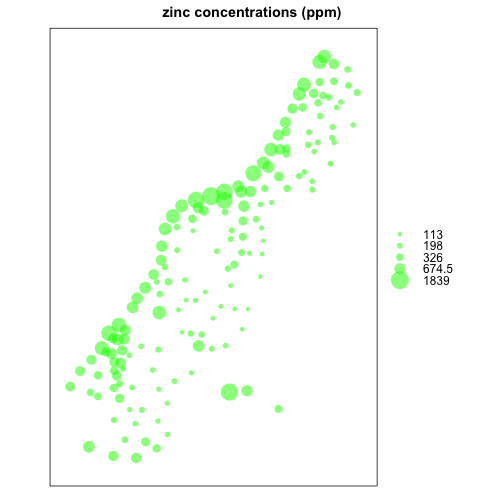 

The equivalent can also be made using `ggplot`:


```r
# I think the blue stands out better against the white background
meuse %>% as.data.frame %>% 
  ggplot(aes(x, y)) + geom_point(aes(size=zinc), color="blue", alpha=3/4) + 
  ggtitle("Zinc Concentration (ppm)") + coord_equal() + theme_bw()
```

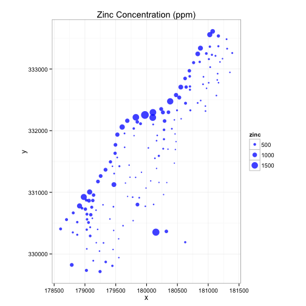 


```r
## Project the data from Rijksdriehoek (RDH) (Netherlands topographical) map 
## coordinates to Google Map coordinates; RDH coordinates have an EPSG code of 
## 28992 and Google map coordinates have an EPSG code of 3857

# But from the documentation of proj4string: Note that only “+proj=longlat” is 
# accepted for geographical coordinates, which must be ordered (eastings, 
# northings). So use sp

# plan: convert rdh to longlat, then assign longlat, then transform to rdh
# TODO: incorporate this into a post on using ggmap with spatial data.
library(rgdal)
```

```
## rgdal: version: 1.0-7, (SVN revision 559)
##  Geospatial Data Abstraction Library extensions to R successfully loaded
##  Loaded GDAL runtime: GDAL 1.11.3, released 2015/09/16
##  Path to GDAL shared files: /usr/local/Cellar/gdal/1.11.3_1/share/gdal
##  Loaded PROJ.4 runtime: Rel. 4.9.2, 08 September 2015, [PJ_VERSION: 492]
##  Path to PROJ.4 shared files: (autodetected)
##  Linking to sp version: 1.1-1
```

```r
ESPG <- make_EPSG()
ESPG[which(ESPG$code == 28992), ]
```

```
##       code                  note
## 4083 28992 # Amersfoort / RD New
##                                                                                                                                                                                                                                     prj4
## 4083 +proj=sterea +lat_0=52.15616055555555 +lon_0=5.38763888888889 +k=0.9999079 +x_0=155000 +y_0=463000 +ellps=bessel +towgs84=565.4171,50.3319,465.5524,-0.398957388243134,0.343987817378283,-1.87740163998045,4.0725 +units=m +no_defs
```

```r
rdh_proj <- ESPG[which(ESPG$code == 28992), "prj4"]

#proj4string(meuse) = "+proj=longlat +datum=WGS84"
```

Along with the `meuse` dataset is one called `meuse.grid`. Later on in the 
interpolation, it's used as locations to predict concentrations for.  At first, 
it's just a regular dataframe like meuse was:


```r
data(meuse.grid)
summary(meuse.grid)
```

```
##        x                y              part.a           part.b      
##  Min.   :178460   Min.   :329620   Min.   :0.0000   Min.   :0.0000  
##  1st Qu.:179420   1st Qu.:330460   1st Qu.:0.0000   1st Qu.:0.0000  
##  Median :179980   Median :331220   Median :0.0000   Median :1.0000  
##  Mean   :179985   Mean   :331348   Mean   :0.3986   Mean   :0.6014  
##  3rd Qu.:180580   3rd Qu.:332140   3rd Qu.:1.0000   3rd Qu.:1.0000  
##  Max.   :181540   Max.   :333740   Max.   :1.0000   Max.   :1.0000  
##       dist        soil     ffreq   
##  Min.   :0.0000   1:1665   1: 779  
##  1st Qu.:0.1193   2:1084   2:1335  
##  Median :0.2715   3: 354   3: 989  
##  Mean   :0.2971                    
##  3rd Qu.:0.4402                    
##  Max.   :0.9926
```

```r
meuse.grid %>% str
```

```
## 'data.frame':	3103 obs. of  7 variables:
##  $ x     : num  181180 181140 181180 181220 181100 ...
##  $ y     : num  333740 333700 333700 333700 333660 ...
##  $ part.a: num  1 1 1 1 1 1 1 1 1 1 ...
##  $ part.b: num  0 0 0 0 0 0 0 0 0 0 ...
##  $ dist  : num  0 0 0.0122 0.0435 0 ...
##  $ soil  : Factor w/ 3 levels "1","2","3": 1 1 1 1 1 1 1 1 1 1 ...
##  $ ffreq : Factor w/ 3 levels "1","2","3": 1 1 1 1 1 1 1 1 1 1 ...
```

```r
meuse.grid %>% class
```

```
## [1] "data.frame"
```

To better see the gridded nature of the data, we can just plot it:


```r
# this is clearly gridded over the region of interest
meuse.grid %>% as.data.frame %>% 
  ggplot(aes(x, y)) + geom_point(size=1) + coord_equal()
```

 

```r
# to compare, recall the bubble plot above; those points were what there were 
# values for. this is much more sparse
meuse %>% as.data.frame %>% 
  ggplot(aes(x, y)) + geom_point(size=1) + coord_equal()
```

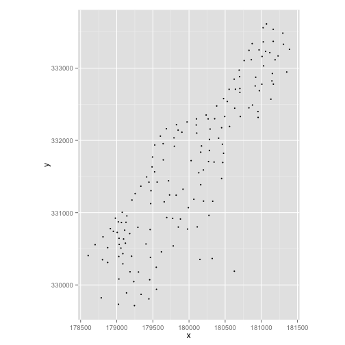 

These two plots pretty much summarize our interpolation problem: given values 
at the locations in the latter plot, we want to interpolate over all values in 
the former plot. 

And just as before, we specify that the `x` and `y` columns are actually coordinates 
for the observations. Here, though, we can also manually specify that meuse.grid 
actually cotains a grid of points. Although this might not appear to change 
anything if you only inspect the class, the attributes of the object do change 
(to see that, just check the attributes before and after identifying it as 
gridded).


```r
coordinates(meuse.grid) = ~x+y
gridded(meuse.grid) = TRUE
meuse.grid %>% class
```

```
## [1] "SpatialPixelsDataFrame"
## attr(,"package")
## [1] "sp"
```

More plotting


```r
image(meuse.grid["dist"])
title("distance to river (red=0)")
```

 

```r
# ggplot version
meuse.grid %>% as.data.frame %>%
  ggplot(aes(x, y)) + geom_tile(aes(fill=dist)) + 
  scale_fill_gradient(low = "red", high="yellow") + coord_equal() + theme_bw() + 
  ggtitle("Distance to River")
```

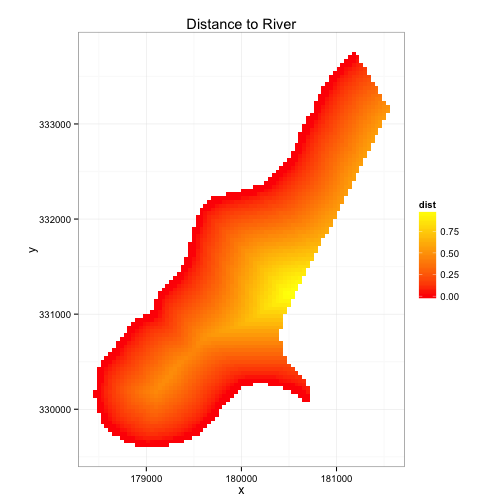 

Alternatively, instead of using tiles, one could go Seurat-style and call 
`geom_point` with small size (but, just note that `scale_color_gradient` goes with 
points, and `scale_fill_gradient` with tiles). 

## Kriging interpolation of remaining points

To recap up to this point: we have values at some points, and want to 
interpolate over an entire grid. In this case, we can use gstat's kriging 
functions. In particular, we'll just start off with the simple `krige` for now.


```r
library(gstat)
```

```
## Warning: package 'gstat' was built under R version 3.1.3
```

```r
zinc.idw <- krige(zinc ~ 1, meuse, meuse.grid)
```

```
## [inverse distance weighted interpolation]
```

```r
zinc.idw %>% class
```

```
## [1] "SpatialPixelsDataFrame"
## attr(,"package")
## [1] "sp"
```

```r
zinc.idw %>% as.data.frame %>% head
```

```
##        x      y var1.pred var1.var
## 1 181180 333740  633.6864       NA
## 2 181140 333700  712.5450       NA
## 3 181180 333700  654.1617       NA
## 4 181220 333700  604.4422       NA
## 5 181100 333660  857.2558       NA
## 6 181140 333660  755.5061       NA
```

Here, there are a couple things to note. First, the function takes a "formula" 
argument. Since we want to interpolate for values of `zinc`, we would use 
"ordinary", or "simple", kriging, in which case we use the notation 
"[variable] ~ 1". The second argument is the where the values of that 
variable being interpolated, come from. The third is the region of interest, 
such as a grid of spatial locations we want estimated predictions for.

The result of the kriging is a data frame with coordinates (`x` and `y`), 
predicted values of the variable (`var1.pred`), and variance of the 
predictions (`var1.var`). (Aside: I'm not really sure why in this example, there are `NA`'s 
for the prediction variance; I think it's because a variogram wasn't supplied 
to form the predictions from. However, I'm almost not clear how there can be 
predictions without that variogram, but I haven't studied much of the theory 
behind this yet).

These results, again, can be graphed with the sp package's functions, or 
otherwise with `ggplot2`:


```r
spplot(zinc.idw["var1.pred"], main="zinc inverse distance weighted interpolations")
```

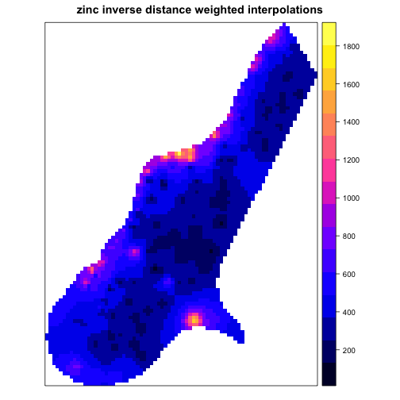 

```r
#same spplot with ggplot 
library(scales)
```

```
## Warning: package 'scales' was built under R version 3.1.3
```

```r
zinc.idw %>% as.data.frame %>% 
  ggplot(aes(x=x, y=y, fill=var1.pred)) + geom_tile() + theme_bw() + 
  coord_equal() + scale_fill_gradient(low = "red", high="yellow") + 
  ggtitle("zinc inverse distance weighted interpolations") + 
  scale_x_continuous(labels=comma) + scale_y_continuous(labels=comma) 
```

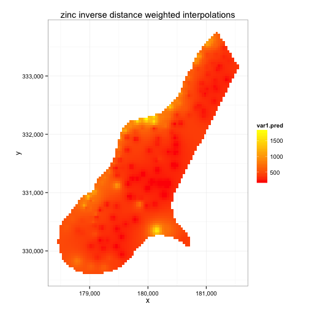 

One advantage of ggplot2 in this case is the amount of control over the color 
scheme (as well as other aspects of the plot). In the example above, I stuck 
to the red-to-yellow scale used earlier. Although, note that here, red doesn't 
represent `0` anymore.


```r
# graphical check of hypothesis from above graphs
plot(log(zinc) ~ sqrt(dist), data=meuse, pch=16, cex=.5)
abline(lm(log(zinc) ~ sqrt(dist), meuse))
```

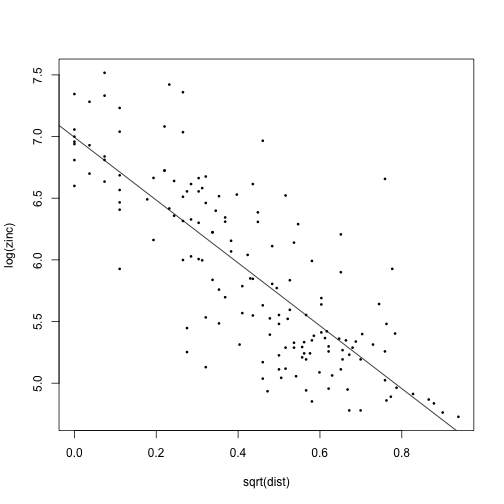 

```r
# or with ggplot:
# meuse %>% as.data.frame %>% 
#   ggplot(aes(sqrt(dist), log(zinc))) + geom_point() + 
#   geom_smooth(method="lm", se=FALSE)
```


## Variogram plotting 

As alluded to earlier, it's often helpful when performing kriging to also have 
a variogram (or, semi-variogram) model fit to the data. For an excellent 
introduction to variograms, see 
[Allison Lassiter's website](http://allisonlassiter.com/2014/05/13/kriging-overview-part-1-variograms/).

Basically, while we did interpolate using a relationship for zinc, we might 
want to explore how `log(zinc)`` varies over space. For this, we can plot a 
variogram. First, the code, then more explanation about what the code does.


```r
# inspect variation of log(zinc) by distance (i.e., from the river)
lzn.vgm <- variogram(log(zinc)~1, meuse) # calculates sample variogram values
lzn.fit <- fit.variogram(lzn.vgm, model=vgm(1, "Sph", 900, 1)) # fit model
plot(lzn.vgm, lzn.fit) # plot the sample values, along with the fit model
```

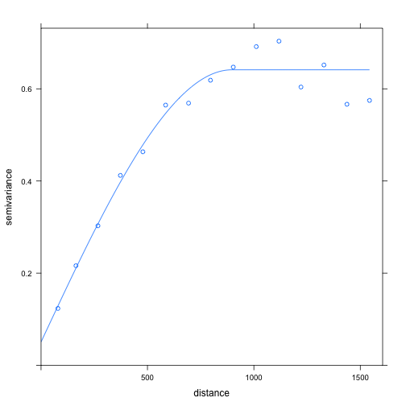 

In the first line, we merely calculate a sample variogram. This involves 
several things, as can be seen by inspecting the actual object: 


```r
lzn.vgm
```

```
##     np       dist     gamma dir.hor dir.ver   id
## 1   57   79.29244 0.1234479       0       0 var1
## 2  299  163.97367 0.2162185       0       0 var1
## 3  419  267.36483 0.3027859       0       0 var1
## 4  457  372.73542 0.4121448       0       0 var1
## 5  547  478.47670 0.4634128       0       0 var1
## 6  533  585.34058 0.5646933       0       0 var1
## 7  574  693.14526 0.5689683       0       0 var1
## 8  564  796.18365 0.6186769       0       0 var1
## 9  589  903.14650 0.6471479       0       0 var1
## 10 543 1011.29177 0.6915705       0       0 var1
## 11 500 1117.86235 0.7033984       0       0 var1
## 12 477 1221.32810 0.6038770       0       0 var1
## 13 452 1329.16407 0.6517158       0       0 var1
## 14 457 1437.25620 0.5665318       0       0 var1
## 15 415 1543.20248 0.5748227       0       0 var1
```

```r
lzn.vgm %>% class
```

```
## [1] "gstatVariogram" "data.frame"
```

```r
lzn.fit %>% class
```

```
## [1] "variogramModel" "data.frame"
```

The first column, np, says how many point pairs were within distance "dist" (if 
those numbers look like a lot, recall that although meuse has only 155 rows, 
there are 155 * 154 / 2 = 11,935 point pairs; see the plot above with 
the points graphed). If we plot this object itself, we just get the sample 
variogram, without any fit to it (try it!). 

To perform a fit, we call the `fit.variogram` function, and pass it two 
parameters: a variogram object, and a model we want to fit the data to. With the 
model specified, the function would find the optimal (in some sense) parameters 
for that model to fit  the data. 

In this tutorial, a spherical model is used. The book Applied Spatial Data Analysis 
with R (ASDAR) has the complete list of variogram models one can use. And while 
the functional forms of those models aren't included, a more 
graphical/qualitative display of characteristics for different variogram models, 
is available by calling the function: `show.vgms()`. 

Now if you plot the variogram and the fit, you (surprise!) get both together. 

But we might not like that model. So we could try to see how `log(zinc)` varies 
with the square root of distance. This time, we'll try an exponential model. 
Otherwise, everything is pretty much the same as before:


```r
# inspect variation of log(zinc) by square root of distance 
lznr.vgm <- variogram(log(zinc) ~ sqrt(dist), meuse)
lznr.fit <- fit.variogram(lznr.vgm, model=vgm(1, "Exp", 300, 1))
lznr.fit %>% class
```

```
## [1] "variogramModel" "data.frame"
```

```r
plot(lznr.vgm, lznr.fit)
```

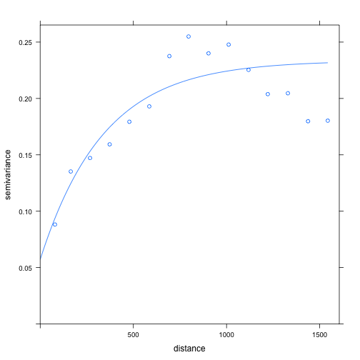 

## Section 6: Kriging

 question: how do kriging results vary if no model specified?
 question: how does kriging happen when no projection specified? This seems 
           to be opposed to the meuse tutorial.
 note: here, interpolation done on gridded SPDF, but this time, result is 
       another SPDF (unlike when not specifying vgm model). Also, there are 
       values for var1.var in the output (which seems to be variance of 
       the prediction). 


```r
lzn.kriged <- krige(log(zinc) ~ 1, meuse, meuse.grid, model=lzn.fit)
```

```
## [using ordinary kriging]
```


```r
# sp plotting
spplot(lzn.kriged["var1.pred"])
```

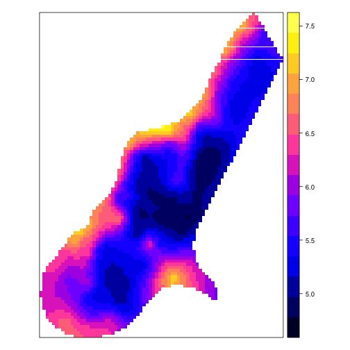 


```r
# kriging results in ggplot
lzn.kriged %>% as.data.frame %>% 
  ggplot(aes(x=x, y=y)) + geom_tile(aes(fill=var1.pred)) + 
  coord_equal() + scale_fill_gradient(low = "red", high="yellow") + 
  scale_x_continuous(labels=comma) + scale_y_continuous(labels=comma) + 
  theme_bw() 
```

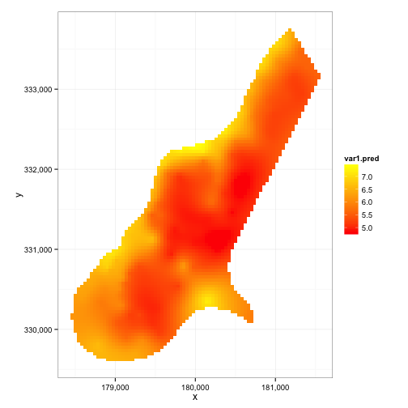 


## Section 7: Conditional Simulations


```r
lzn.condsim <- krige(log(zinc)~1, meuse, meuse.grid, model=lzn.fit, 
                     nmax=30, nsim=4)
```

```
## drawing 4 GLS realisations of beta...
## [using conditional Gaussian simulation]
```

```r
# sp plotting
spplot(lzn.condsim, main="three conditional simulations")
```

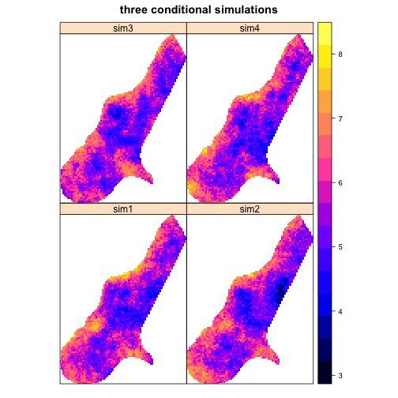 


```r
# with ggplot2. (no need to call components with "@" or "attr(., "data"), e.g.) 
#lzn_cond_df <- cbind(attr(lzn.condsim, "data"), attr(lzn.condsim, "coords"))
lzn.condsim %>% as.data.frame %>% 
  gather(sim, value, sim1:sim4) %>% 
  ggplot(aes(x=x, y=y)) + geom_tile(aes(fill=value)) + 
  facet_grid(.~sim) + coord_fixed(ratio = 1) + 
  scale_x_continuous(labels=comma) + scale_y_continuous(labels=comma) + 
  scale_fill_gradient(low = "red", high="yellow") + 
  ggtitle("Three conditional simulations") + theme_bw()
```

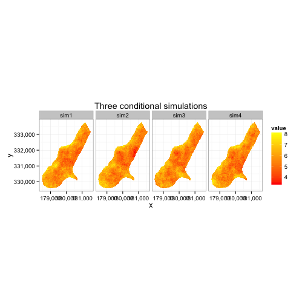 


