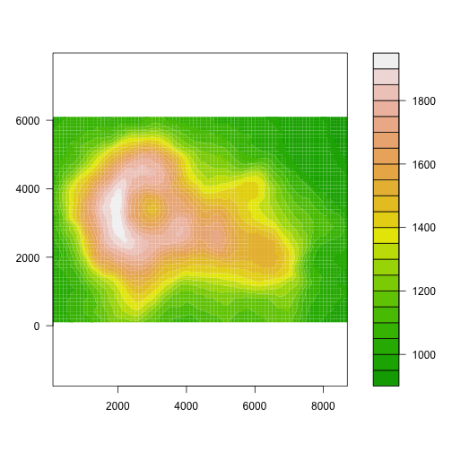

## Background

This is basically taken (with minor modifications and commentary) from the man page of the ncdf package, and [this extremely useful webpage](http://www.image.ucar.edu/GSP/Software/Netcdf/), which explores in much more detail some about the netcdf format, and about working with it.

## Reading from ncdf


```r
library(ncdf)
library(magrittr)
```

If you want to READ data from an already-existing netCDF file, first call open.ncdf to open the file, then call get.var.ncdf to read the data from the file.


```r
ex <- open.ncdf("~/example.nc")
print(ex)
```

```
## [1] "file ~/example.nc has 2 dimensions:"
## [1] "EW   Size: 87"
## [1] "SN   Size: 61"
## [1] "------------------------"
## [1] "file ~/example.nc has 1 variables:"
## [1] "float Elevation[EW,SN]  Longname:The Classic R New Zealand Volcano Missval:-1"
```

(The default "print" function for ncdf files is actually pretty similar to the header of the ncdf file; if you have the "ncdump" command line tool, try ncdump -h PATH/TO/FILE).

These data consists of an 87X61 matrix of the variable 'Elevation' and the coordinate variables associated with the 2 dimensions: SN ( south - north axis ) and EW ( east-west axis). The elevations are from the R data set volcano. To retrieve the relevant variables: 


```r
y = ex %>% get.var.ncdf("SN")          # coordinate variable
x = ex %>% get.var.ncdf("EW")          # coordinate variable
z = ex %>% get.var.ncdf("Elevation")   # variable
```

We can manually verify that each of the coordinate variables is a vector of the values for that dimension of the matrix:


```r
y %>% str
```

```
##  num [1:61(1d)] 100 200 300 400 500 600 700 800 900 1000 ...
```

```r
x %>% str
```

```
##  num [1:87(1d)] 100 200 300 400 500 600 700 800 900 1000 ...
```

and we can make a surface plot of the elevations as well:


```r
# image plot of terrain cribbed from help(volcano)
filled.contour(x,y,z, color = terrain.colors, asp = 1)
```

 


## Writing to ncdf

To illustrate how one writes to ncdf format, we can use the volcano dataset. This is a rough approximation of an actually grid of topographic elevations around a mountain, and almost identical to the dataset used above. 


```r
data(volcano)
volcano %>% str
```

```
##  num [1:87, 1:61] 100 101 102 103 104 105 105 106 107 108 ...
```

Storing the elevations and grid dimensions in variables:


```r
# put the data in a handy form 
z <- 10*volcano         # matrix of elevations
x <- 100* (1:nrow(z))   # meter spacing (S to N)
y <- 100* (1:ncol(z))   # meter spacing (E to W)
```

There are a few steps to follow to write data to a new netCDF file:

1. Call dim.def.ncdf to define the dimensions that your data exists along (for example, perhaps latitude and longitude)

2. Call var.def.ncdf to define a variable in the netCDF file that will hold your data

3. Call create.ncdf to create the netCDF file, then call put.var.ncdf to write your data to the newly created netCDF file.


```r
# define the netcdf coordinate variables -- note these have values!

dim1 <- dim.def.ncdf( name = "EW", units = "meters", vals = as.double(x) )
dim2 <- dim.def.ncdf( name = "SN", units = "meters", vals = as.double(y) )

# define the EMPTY (elevation) netcdf variable

varz <- var.def.ncdf(name = "Elevation", units =  "meters", 
                    dim = list(dim1, dim2), missval = -1, 
                    longname ="The Classic R New Zealand Volcano")
```


```r
# associate the netcdf variable with a netcdf file   
# put the variable into the file, and
# close

nc.ex <- create.ncdf( filename = "~/example.nc", vars = varz )
put.var.ncdf(nc = nc.ex, varid = varz, vals = z)

# data storage is complete, so just need to close the connection
close.ncdf(nc.ex)
```

```
## [[1]]
## [1] 131072
```


## See Also

[This was also very helpful](http://freakonometrics.hypotheses.org/20227) in acclimating to working with netcdf files.


